Go back to [README.md](/README.md)

# Testing
- [Code Validation](#code-validation)
    - [HTML](#html)
    - [CSS](#css)
    - [JavaScript](#JavaScript)
    - [Python](#python)
- [Responsiveness](#Responsiveness)
- [Browser Compatibility](#browser-compatibility)
- [Lighthouse](#Lighthouse)
- [Manual Testing](#manual-testing)

## Code Validation
### HTML
|Page|Validator|Result|
| --- | --- | --- |
| LandingPage |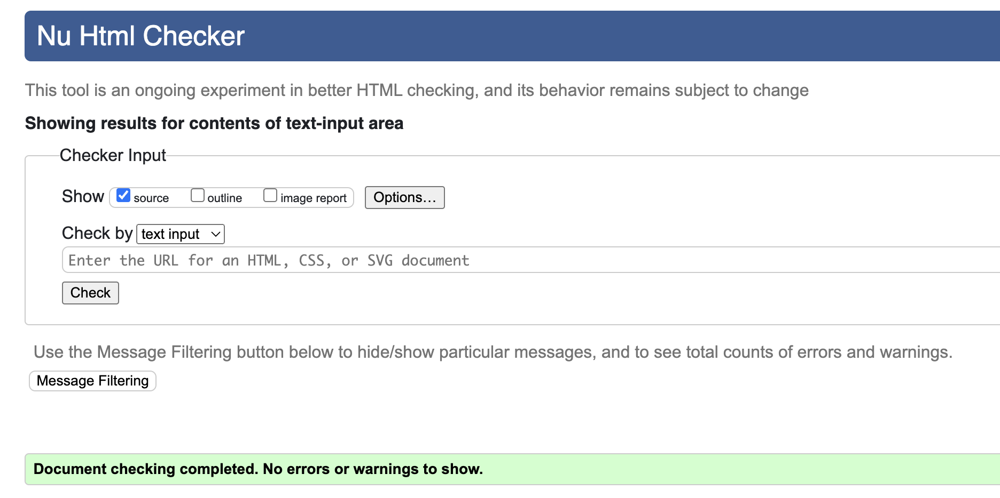 | <mark>PASS<mark> |
| About Us |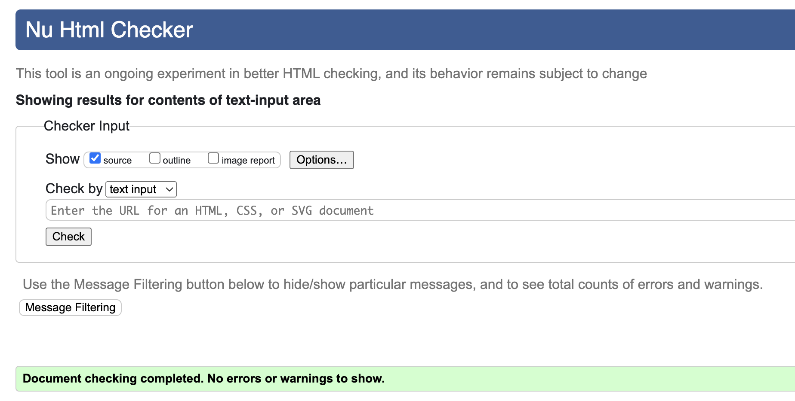 | <mark>PASS<mark> |
| Popular Courses|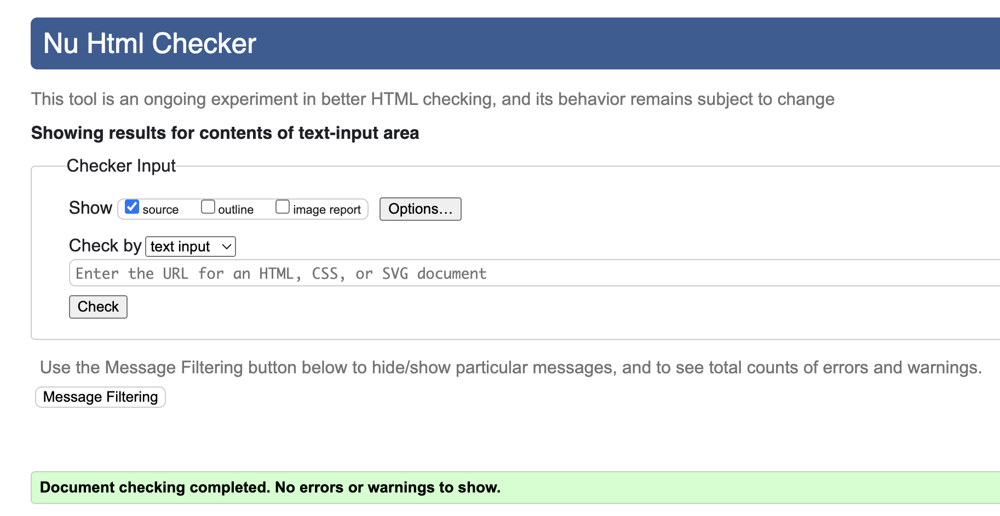 | <mark>PASS<mark> |
| Sign Up |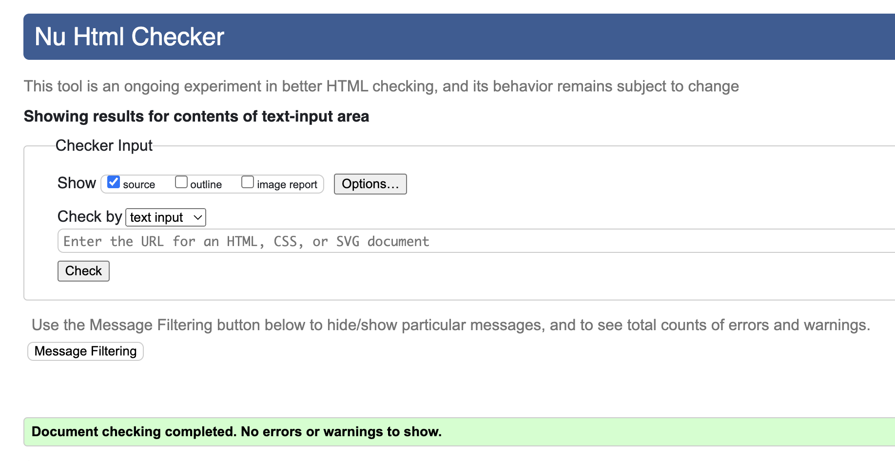 | <mark>PASS<mark> |
| Log In |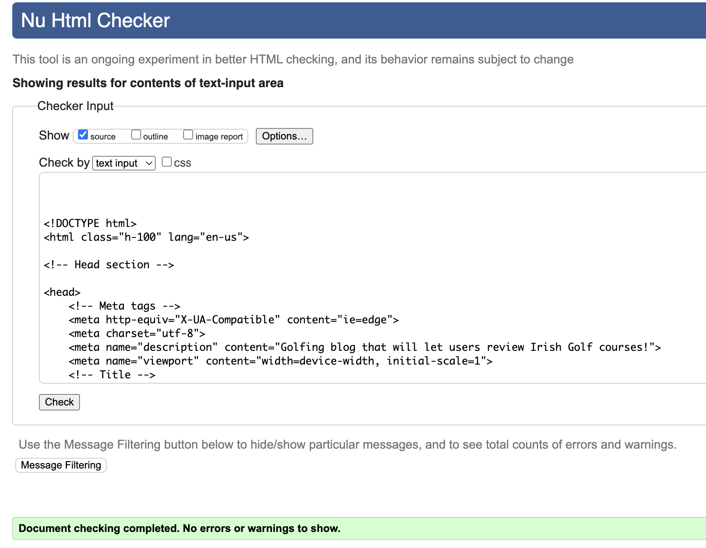 | <mark>PASS<mark> |
| My Profile |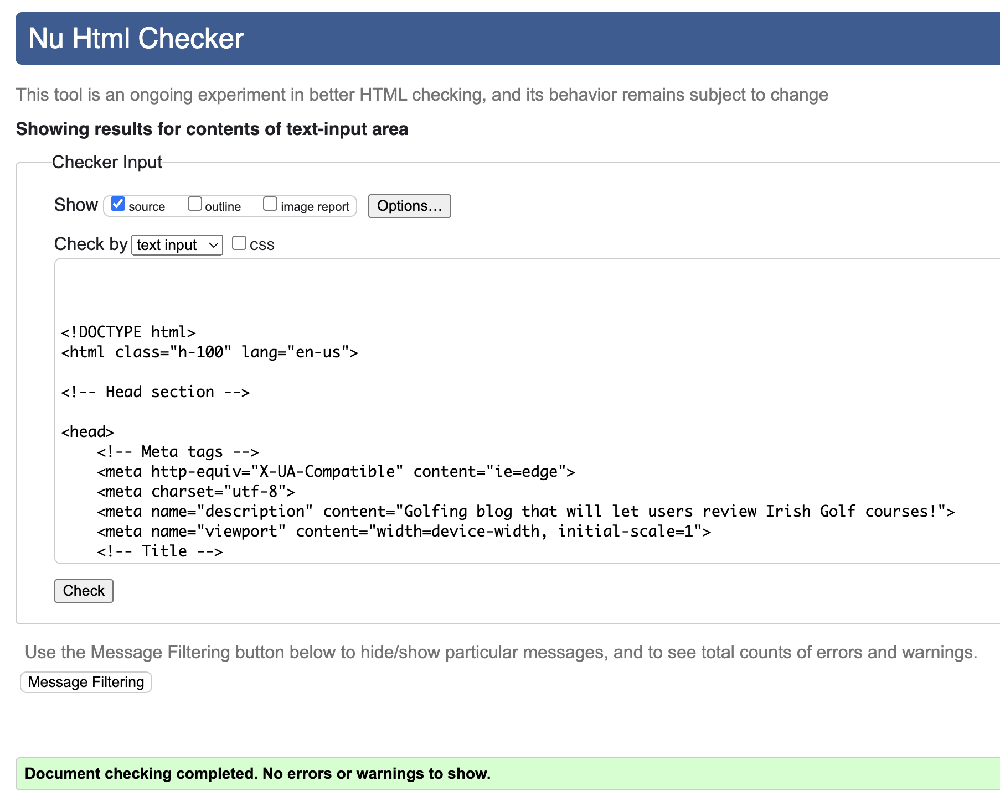 | <mark>PASS<mark> |
| Create Blog |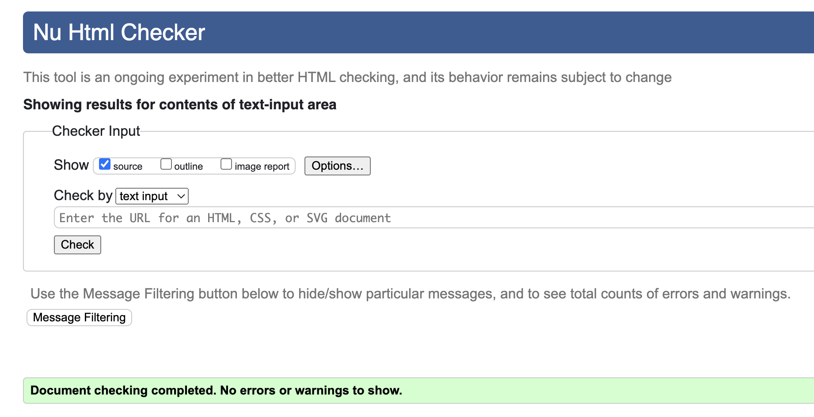 | <mark>PASS<mark> |
| My Blogs|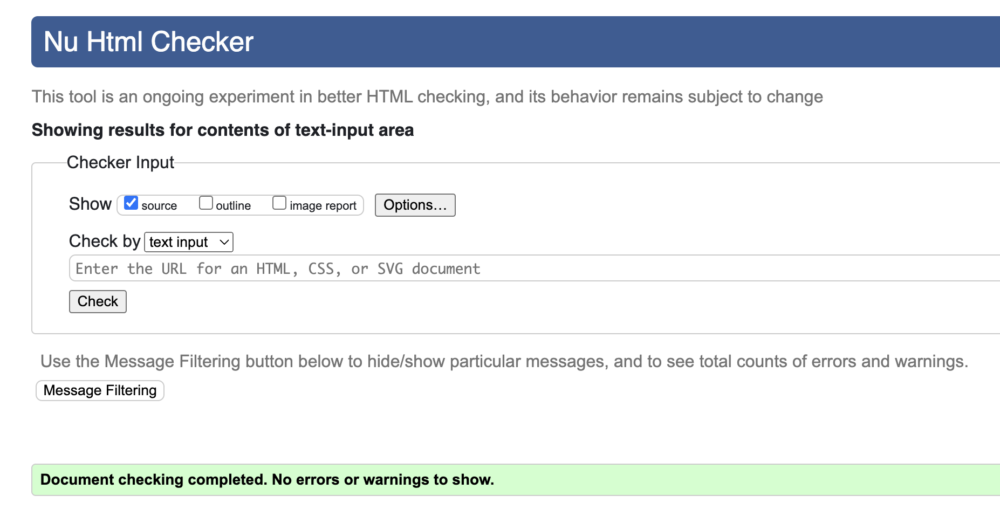 | <mark>PASS<mark> |
| Update Blog |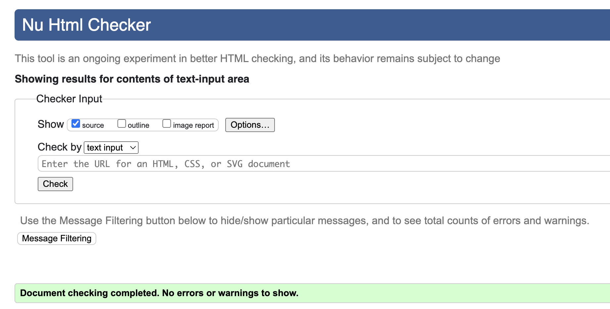 | <mark>PASS<mark> |
| Delete Blog |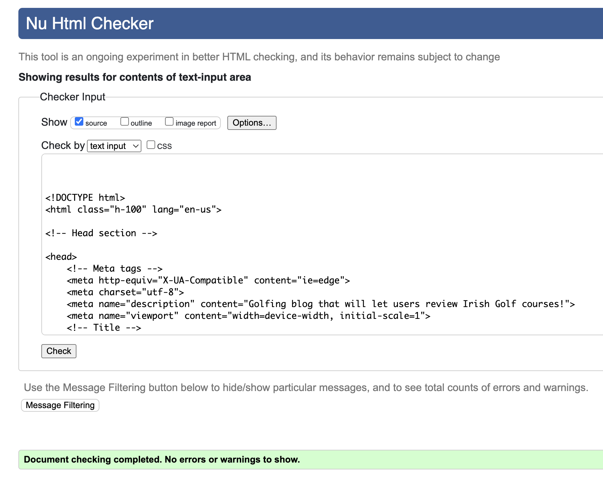 | <mark>PASS<mark> |
| Log Out |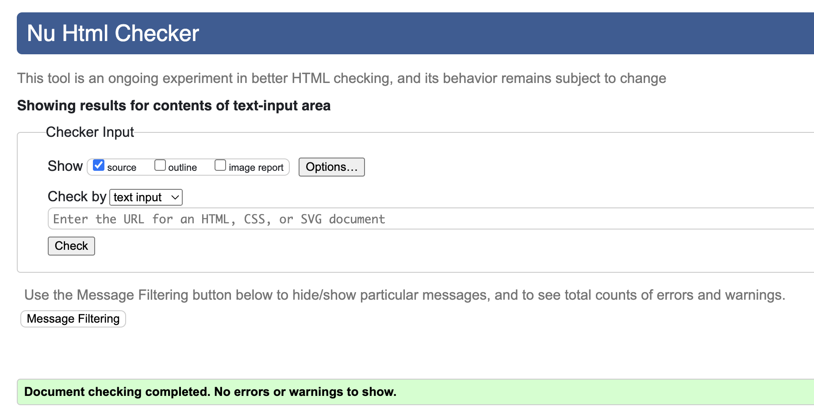 | <mark>PASS<mark> |

### CSS
|file|Validator|Result|
| --- | --- | --- |
| style.css |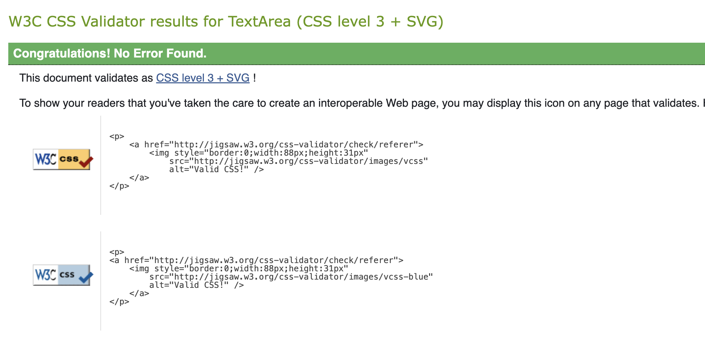 | <mark>PASS<mark> |

## JavaScript
|file|Validator|Result|Comment|
| --- | --- | --- |----|

| profile.js | | <mark>PASS<mark> |This is js script from CI's walkthrough. I did not want to change this as the function is working. It has two warnings and shows $ as undefined variable |

## Python

|File|App|Image|Result|Comment|
| --- |----| --- | --- |----|
| urls | the_golfers | | <mark>PASS<mark> ||
| admin | blog | | <mark>PASS<mark> ||
| apps | blog | | <mark>PASS<mark> ||
| forms | blog | | <mark>PASS<mark> ||
| models | blog | | <mark>PASS<mark> ||
| urls | blog | | <mark>PASS<mark> ||
| views | blog | | <mark>PASS<mark> ||

## Browser Compatibility

|Browser|Result|Pass/Fail|Notes|
| --- | --- | --- | ---|
| Google Chrome | All pages, load as expected. All features work as expected | PASS | --- |
| Firefox | All pages, load as expected. All features work as expected | PASS | --- |
| Edge | All pages, load as expected. All features work as expected | PASS | ---|

## Lighthouse

|Page|Validator|Result|
| --- | --- | --- |
| Home Desktop | | <mark>PASS<mark> |
| Log-In Desktop | | <mark>PASS<mark> |
| Log-Out Desktop | | <mark>PASS<mark> |
| My Wallet Desktop | | <mark>PASS<mark> |
| Products Desktop | | <mark>PASS<mark> |
| Profile Desktop | | <mark>PASS<mark> |
| Shopping Bag Desktop | | <mark>PASS<mark> |